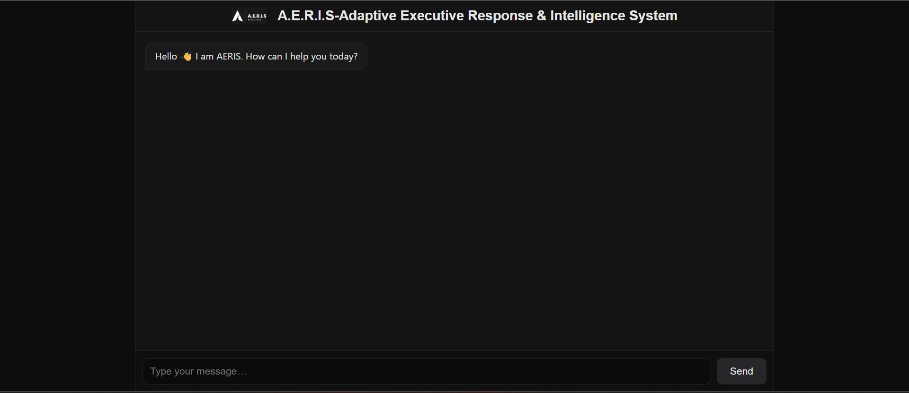
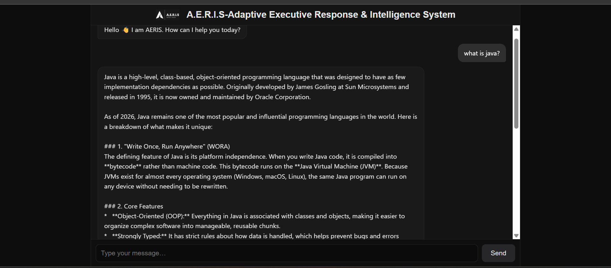

# Aeris AI
Aeris AI is a Java-based virtual assistant inspired by JARVIS. 
It processes user commands and performs backend-driven tasks.

## Built With
- Java 8
- Spring Boot
- Maven

## How to Run the Project
1. Clone the repository
2. Add your own `application.properties`
3. Run:open the server and hit server/aeris.html

## Note
Sensitive configuration files are excluded using .gitignore.

## Project Screenshot

